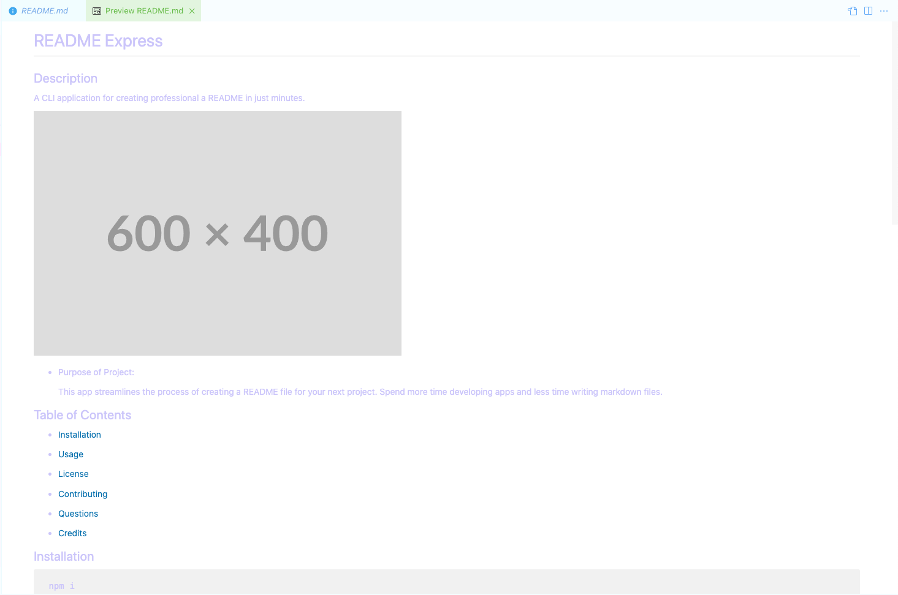

  # README Express
  
  
  ## Description
  A CLI application for creating professional a README in just minutes. 

  
  
  - Purpose of Project:

    This app streamlines the process of creating a README file for your next project. Spend more time developing apps and less time writing markdown files.
  
  ## Table of Contents

 
  - [Installation](#installation)
    
  - [Usage](#usage)
    
  - [License](#license) 
   
  - [Contributing](#contributing) 
     
  - [Questions](#questions)  
    
  - [Credits](#credits)  
    
## Installation

  cd to 'index.js', then:
       
       
     npm i  
    
## Usage
    
       
  Answer the questions as they appear in the CLI. After the questions are answered, the README file will appear in the /develop folder.
    
## License

  
   
  Copyright 2023   Noah Burton

  Permission is hereby granted, free of charge, to any person obtaining a copy of this software and associated documentation files (the “Software”), to deal in the Software without restriction, including without limitation the rights to use, copy, modify, merge, publish, distribute, sublicense, and/or sell copies of the Software, and to permit persons to whom the Software is furnished to do so, subject to the following conditions:

  The above copyright notice and this permission notice shall be included in all copies or substantial portions of the Software.

  THE SOFTWARE IS PROVIDED “AS IS”, WITHOUT WARRANTY OF ANY KIND, EXPRESS OR IMPLIED, INCLUDING BUT NOT LIMITED TO THE WARRANTIES OF MERCHANTABILITY, FITNESS FOR A PARTICULAR PURPOSE AND NONINFRINGEMENT. IN NO EVENT SHALL THE AUTHORS OR COPYRIGHT HOLDERS BE LIABLE FOR ANY CLAIM, DAMAGES OR OTHER LIABILITY, WHETHER IN AN ACTION OF CONTRACT, TORT OR OTHERWISE, ARISING FROM, OUT OF OR IN CONNECTION WITH THE SOFTWARE OR THE USE OR OTHER DEALINGS IN THE SOFTWARE.

    
  ## Contributing

  

  1. Fork the Project
  2. Create your Feature Branch ('git checkout -b feature/AmazingFeature')
  3. Commit your Changes ('git commit -m 'Add some AmazingFeature')
  4. Push to the Branch ('git push origin feature/AmazingFeature')
  5. Open a Pull Request
     
  ## Questions

  
  

  

  Contact Email: nburton115@gmail.com
    
  ## Credits
  
  
    
  - [inquirer.js](https://www.npmjs.com/package/inquirer) for text prompts.

      